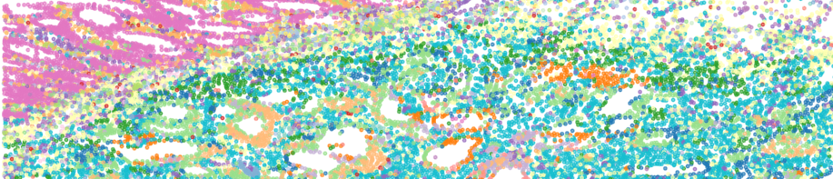
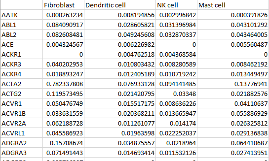
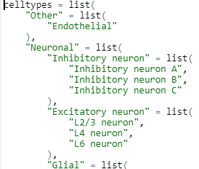
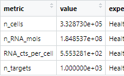
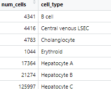
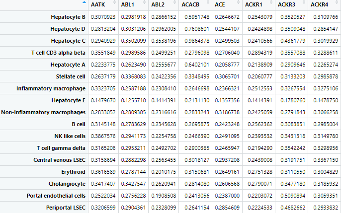
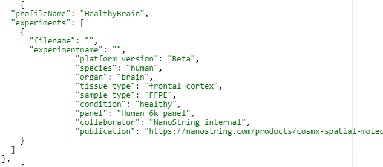

# CosMx-Cell-Profiles

## Overview

This repository contains a library of cell profile matrices with accompanying statistics and metadata. For each featured tissue, the profiles matrix gives the average expression of a variety of cell types relevant cell types. Each matrix in the library was derived from one or more CosMx Spatial Molecular ImagerTM (SMI) experiments. The purposes of these profiles is to aid in CosMx SMI spatial cell typing using the InSituType R package ([pre-print](https://www.biorxiv.org/content/10.1101/2022.10.19.512902v1) and [GitHub repository](https://github.com/Nanostring-Biostats/InSituType)). We offer these cell profile matrices as an alternative to spatially-naive single-cell RNA-seq-based reference profiles for use in cell typing spatial biology experiments.

One profile is presented for each available tissue. The majority are from healthy, adult human samples.

Each profile contains the following components:

1. Cell profiles matrix

2. Cell type hierarchies

3. Basic statistics

4. Target statistics

5. Metadata

## File types

### Cell profiles matrix

CSV file of targets by cell types. Each cell type is a unique row. Each target is a unique column. Where multiple experiments were combined, only the intersection of targets was used.

### Cell Type Hierarchies

R file defining a nested list object so users can group cell type categories. Human-readable ensures non-R users (e.g., Python) can parse and use.

### Basic Statistics

CSV files of basic statistics on the profiles: number of input cells of each type per profile, standard deviation for each target, etc.

### Target statistics

CSV files of average and standard deviation of targets in profiles so that users can remove targets as desired.

### Metadata

JSON file on experimental design and attribution, including collaborators (if applicable), species, tissue type/substructure, CosMx instrument version, input panel, etc.

## Usage

***If you use the cell profiles in your work, please include citations applicable for the relevant tissue(s). See the Metadata file for more information.***

These matrices can be downloaded directly and loaded into environments for analysis with R, Python, etc. They're intended for use with the InSituType package's semi- and fully-supervised cell typing  methods, with data generated from CosMx 1k and 6k RNA panels only only.

Caution:

* We do not recommend combining CosMx-derived cell type profiles with scRNA-seq derived profiles in cell typing. For example, in a cancerous sample, we advise against combining the CosMx IO profiles with scRNA-seq profiles for the tissue type.

* All current profiles were derived from CosMx 1k data. They are not intended for use with WTx experiments.

## Methodology

All profiles were derived from CosMx SMI experiments generated in-house. Projects with high-confidence cell typing were identified and permission obtained from collaborators/customers where necessary. Cell type names were corrected for consistent style. Where necessary, poor-confidence typed cells as well as genes with high discordance between CosMx-derived and scRNA-seq derived profiles were removed. In profiles built from multiple experiments, only the intersection of targets was used. `InSituType::Estep()` was run to generate mean expression profiles from the raw counts of cells x targets, negative probe counts, and given cell types. 

Please note the profiles, while derived from CosMx SMI experiments, may not contain the exact suite of targets of current CosMx panel products. 

## See Also

NanoString has compiled a resource of publicly-available scRNA-seq-derived cell profile matrices, [Cell Profile Library](https://github.com/Nanostring-Biostats/CellProfileLibrary), for use with the SpatialDecon [R package](https://bioconductor.org/packages/release/bioc/html/SpatialDecon.html) ([paper](https://www.nature.com/articles/s41467-022-28020-5)).

Thank you for your interest in our cell profiles derived from CosMx SMI spatial biology datasets. If necessary, please file a GitHub Issue here or contact support@nanostring.com for more information.
