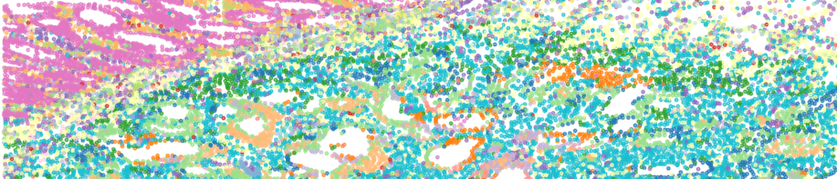
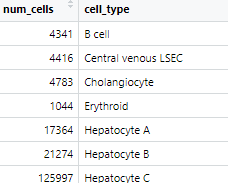
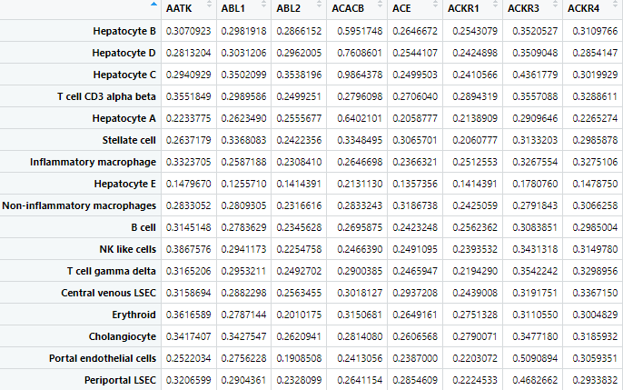

# CosMx-Cell-Profiles

## Overview

This repository contains a library of cell profile matrices with accompanying statistics and metadata. For each featured tissue, the profiles matrix gives the average expression of a variety of relevant cell types. Each matrix in the library was derived from one or more CosMx&#174; Spatial Molecular Imager (SMI) experiments. The purpose of these profiles is to aid in CosMx SMI spatial cell typing using the InSituType R package ([pre-print](https://www.biorxiv.org/content/10.1101/2022.10.19.512902v1) and [GitHub repository](https://github.com/Nanostring-Biostats/InSituType)). We offer these cell profile matrices as an alternative to spatially-naive single-cell RNA-seq-based reference profiles for use in cell typing spatial biology experiments. There are profiles from healthy and cancerous adult human samples as well as mouse brain.

Each profile contains the following components:

1. Cell profiles matrix

2. Cell type annotations

3. Basic statistics

4. Target statistics

5. Metadata

## File types

### Cell profiles matrix

CSV file of targets by cell types. Each cell type is a unique row. Each target is a unique column. Where multiple experiments were combined, only the intersection of targets was used.

### Cell type annotations

To put cell types in context, we offer both cell type hierarchies and ontology terms.

The hierarchies are in R files defining a nested list object so users can group cell type categories. Human-readable ensures non-R users (e.g., Python) can parse and use. Note that some inner nodes on the hierarchies are both lower-granularity categorizations as well as a final cell type included in the profiles themselves.

[Cell Ontology](https://obofoundry.org/ontology/cl.html) annotations are also provided.

### Basic statistics

CSV files of basic statistics on the profiles: number of input cells of each type per profile, standard deviation for each target, etc.

### Target statistics

CSV files of average and standard deviation of targets in profiles so that users may remove targets as desired.

### Metadata

JSON file on experimental design and attribution, including collaborators (if applicable), species, tissue type/substructure, CosMx instrument version, input panel, etc. Please cite the source of the data if using the CosMx cell profiles in your work.

## Usage

***If you use the cell profiles in your work, please include citations applicable for the relevant tissue(s). See the Metadata file for more information.***

These matrices can be downloaded directly and loaded into environments for analysis with R, Python, etc. They're intended for use with the InSituType package's semi- and fully-supervised cell typing  methods.

Caution:

* We do not recommend combining CosMx-derived cell type profiles with scRNA-seq derived profiles in cell typing. For example, we advise against combining the CosMx IO profiles with scRNA-seq profiles for the tissue type.

* Note that some inner nodes on the hierarchies are both lower-granularity categorizations as well as a final cell type included in the profiles themselves.

* If you choose to combine multiple CosMx SMI-derived profiles into a single hybrid reference, please see our [Scratch Space post here](https://nanostring-biostats.github.io/CosMx-Analysis-Scratch-Space/posts/hybrid-reference-profiles/) for guidance.

## Methodology

All profiles were derived from CosMx SMI experiments. Projects with high-confidence cell typing were identified and permission obtained from collaborators/customers where necessary. Cell type names were corrected for consistent style. Where necessary, poor-confidence typed cells as well as genes with high discordance between CosMx SMI-derived and scRNA-seq derived profiles were removed. In profiles built from multiple experiments, only the intersection of targets was used. `InSituType::Estep()` was run to generate mean expression profiles from the raw counts of cells x targets, negative probe counts, and given cell types. 

Please note the profiles, while derived from CosMx SMI experiments, may not contain the exact suite of targets of current CosMx panel products. 

## Contribution

If you would like to contribute to the CosMx Cell Profiles repository with data from your experiments, please contact us at support.spatial@bruker.com. Broadly speaking, the process involves a license agreement, finalized cell typing, and generation of the standardized file types of the the repository as outlined above.

## See Also

Bruker Spatial Biology has compiled a resource of publicly-available scRNA-seq-derived cell profile matrices, [Cell Profile Library](https://github.com/Nanostring-Biostats/CellProfileLibrary). This resource can be used in CosMx SMI cell typing (see note on InSituType in Overview) or with GeoMx&reg; Digital Spatial Profiler data using with the SpatialDecon [R package](https://bioconductor.org/packages/release/bioc/html/SpatialDecon.html) ([paper](https://www.nature.com/articles/s41467-022-28020-5)). For more information on how to analyze and explore CosMx SMI data, please visit out our [Scratch Space Blog](https://nanostring-biostats.github.io/CosMx-Analysis-Scratch-Space/).

Thank you for your interest in our cell profiles derived from CosMx SMI spatial biology datasets. If necessary, please file a GitHub Issue here or contact support.spatial@bruker.com for more information.
